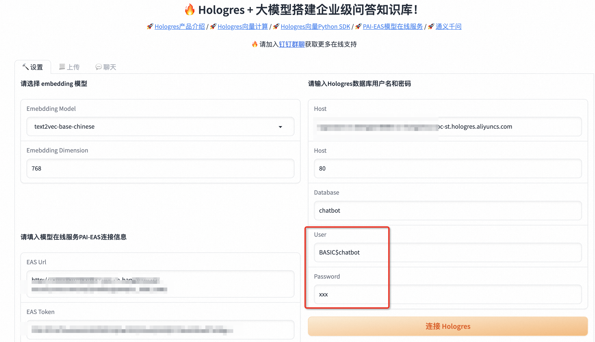
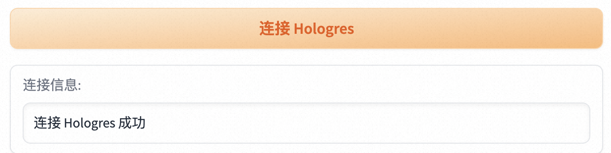
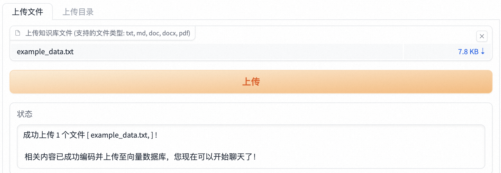
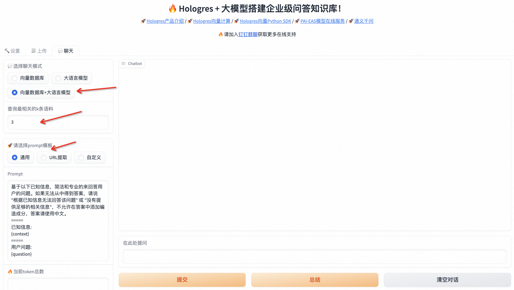
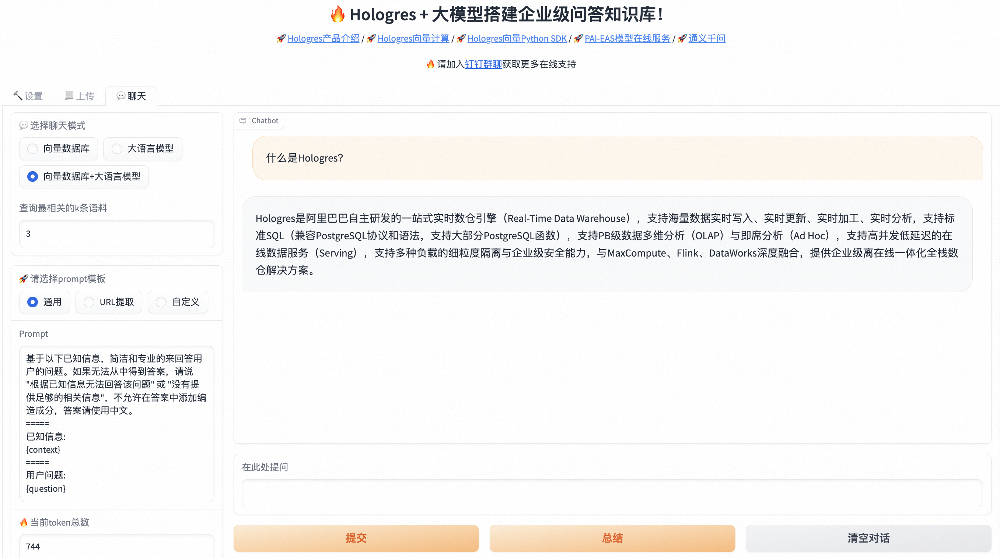

# Hologres+PAI一键部署企业级问答知识库

## 背景信息

Hologres是阿里巴巴自研一站式实时数仓产品，不仅支持海量数据多维分析（OLAP）、高并发低延迟的在线数据服务（Serving），还与达摩院自研高性能向量计算软件库Proxima深度整合，支持高性能、低延时、简单易用的向量计算能力。详情请参见[Proxima向量计算](https://help.aliyun.com/zh/hologres/user-guide/vector-processing-based-on-proxima)。
PAI-EAS是阿里云的模型在线服务平台，支持用户将模型一键部署为在线推理服务或AI-Web应用，可以一键部署LLM推理、AIGC等热门服务应用。PAI-EAS
适用于实时推理、近实时异步推理等多种AI推理场景，具备Serverless自动扩缩容和完整运维监控体系能力。
LangChain是一个开源框架，可以将大模型、向量数据库、定制语料结合，高效完成专属问答知识库的搭建。Hologres现已被LangChain作为向量数据库集成，详情请参见[LangChain-Hologres](https://python.langchain.com/docs/integrations/vectorstores/hologres)。
计算巢服务是一个开放给服务商和用户的服务管理PaaS平台，为服务商和用户提供了高效、便捷、安全的服务使用体验，服务商能更好地在阿里云上部署、交付和管理服务，用户能集中管理在阿里云上订阅的各类服务商提供的服务。通过计算巢，可以一键完成问答知识库所需的硬件资源拉起与软件资源部署。

## 前提条件
如果您使用RAM用户进行知识库搭建，需要通过主账号授予相应资源权限，需要的权限及授权方式请参见[为RAM用户（子账号）授权](https://help.aliyun.com/zh/compute-nest/user-guide/grant-user-permissions-to-a-ram-user)。

## 创建服务实例

1. 点击创建[Hologres+PAI 5分钟一键部署企业级问答知识库](https://computenest.console.aliyun.com/service/instance/create/cn-hangzhou?type=user&ServiceId=service-1dfaa4725aa14cfc8f76)服务实例。

2. 在**创建服务实例**页，配置以下字段

    | **模块** | **参数** | **说明** |
    | --- | --- | --- |
    | 服务实例名称 | | 计算巢服务实例名称 |
    | 地域 | | Hologres、PAI-EAS、ECS实例所在地域 |
    | 付费类型配置 | 付费类型 | ECS和Hologres的计费方式，支持按量付费或包年包月PAI-EAS实例只支持按量付费 |
    | ECS实例配置 | 实例类型 | ECS实例规格 |
    | | 实例密码 | ECS实例登录密码 |
    | Hologres实例配置 | 实例规格 | Hologres计算资源规格Hologres存储资源默认为按量付费，推荐您根据业务数据量，购买合适的[存储抵扣包](https://help.aliyun.com/zh/hologres/product-overview/storage-deduction-package) |
    | PAI-EAS模型配置 | 选择大模型 | 您希望部署的LLM大模型 |
    | | PAI实例规格 | PAI-EAS实例规格 |
    | VPC配置 | 交换机可用区 | 交换机所在可用区 |
    | | 是否新建VPC | |
    | | 专有网络 | 专有网络VPC实例ID或专有网络IPv4网段 |
    | | 交换机 | 交换机实例ID或交换机子网网段 |
    | 标签和资源组 | 标签 | 服务实例需要绑定的标签 |
    | | 资源组 | 服务实例所属的资源组 |

3. 点击**下一步：确认订单**
4. 查看订单页，确保**依赖检查**全部正常，点击**立即创建**
5. 创建“Hologres+PAI一键部署企业级问答知识库”服务实例需耗时5-10分钟，您可以在**服务实例管理**中查看实例情况

## 知识库使用

1. 进入计算巢[服务实例管理](https://computenest.console.aliyun.com/service/instance)页，点击已部署的服务实例ID，进入**服务实例详情**页
2. 点击**实例信息**中的**Endpoint**链接，进入Hologres+大模型**WebUI**

    

3. 在WebUI的**设置**页配置以下信息
    1. Embedding模型：默认选择text2vec-base-chinese模型
    2. PAI-EAS连接信息：已默认填写计算巢部署的PAI-EAS模型的VPC连接信息
    3. Hologres连接信息：
        1. 已默认填写计算巢部署的Hologres实例的VPC Host、Port、Database（chatbot）
        2. 需要您在User和Password中填入您的阿里云AccessKey ID和AccessKey
           Secret，可以在阿里云官网[Access Key管理](https://usercenter.console.aliyun.com/?spm=a2c8b.12215442.nav-right.dak.18fb6253I8gJRw#/manage/ak)
           查看。您也可以在Hologres中创建其他账号用于知识库搭建，详情请参见[Hologres权限模型概述](https://help.aliyun.com/zh/hologres/user-guide/overview)
        3. 点击**连接Hologres**，收到“连接 Hologres 成功”提示，即说明连接成功

4. 在WebUI的**上传**页
    1. 上传您的专属语料数据。后台会对您的语料数据进行向量化处理并导入Hologres
    2. 收到“成功上传 x 个文件”提示，即说明数据处理完成
    3. 您可以在Hologres实例chatbot数据库下的langchain_demo表中查询您的语料数据
   
5. 在WebUI的**聊天**页
    1. 选择聊天模式：
       1. 向量数据库：对您的提问，仅使用Hologres进行向量近似查询，返回top K结果
       2. 大语言模型：对您的提问，仅使用大模型直接进行回答
       3. 向量数据库+大语言模型：对您的提问，使用您已在Hologres中存储的语料数据进行向量近似查询，将结果对大模型进行提示词微调，最终使用大模型推理求解进行回答
   2. 选择最相关的k条语料：默认为3条
   3. 选择prompt模版：建议选择通用模版，您也可以自定义prompt模版
   4. 在提问框中输入您的问题，点击**提交**进行问答 

至此，您已完成企业级问答知识库的调试。
您可以进一步使用PAI-EAS部署的大模型的调用信息（在[PAI控制台](https://pai.console.aliyun.com/)-EAS实例详情页中查看），将知识库接入实际业务场景进行使用，如接入钉钉聊天群聊（参见[使用Hologres和大模型免费定制专属聊天机器人](https://help.aliyun.com/zh/hologres/use-cases/use-hologres-to-customize-chatgpt-exclusive-chatbot-for-free)）等。

